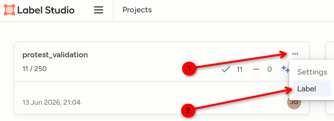
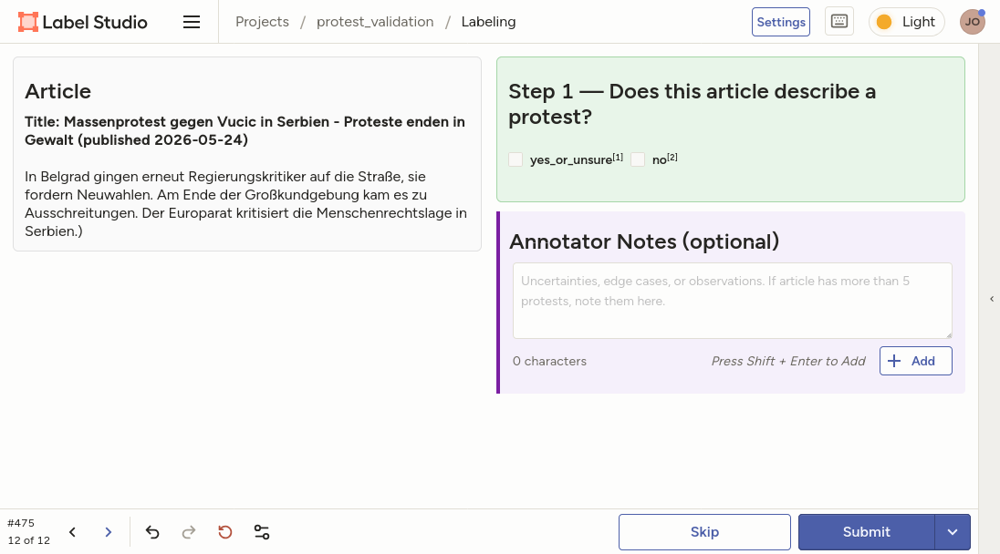

::: {.callout-note appearance="simple"}
Die Oberfläche von Label Studio ist auf Englisch. Alle Beschriftungen, Feldnamen
und Antwortoptionen sind in diesem Codebuch deshalb **auf Englisch belassen**, so
wie sie auf dem Bildschirm stehen. Die Erklärungen dazu sind auf Deutsch.
:::

# Worum es geht

Wir bauen eine offene Datenbank von Protestereignissen in Deutschland auf.
Eine Pipeline sammelt Artikel von rund 74 deutschen Nachrichtenmedien, behält
diejenigen, die *Protest* oder *Demonstration* erwähnen, lädt den Volltext nach und
lässt anschließend ein **lokal laufendes Sprachmodell** jeden Artikel lesen und
einen strukturierten Satz von Variablen ausfüllen (wo, wann, wer, wie viele, worum,
was ist passiert). Das Ergebnis speist ein öffentliches Dashboard für Forschung,
Journalismus und Öffentlichkeit.

Mehr müssen Sie über das Projekt nicht wissen. Wichtig für Ihre Arbeit ist der
nächste Absatz.

## Warum wir Sie brauchen

Wir wissen nicht, wie gut die maschinelle Annotation tatsächlich ist. Um das
herauszufinden, brauchen wir einen **Goldstandard**: dieselben Artikel, sorgfältig
von Menschen kodiert. Ihre Annotationen sind dieser Goldstandard. Wir vergleichen
sie mit der Ausgabe des Modells, um für jede Variable Precision und Recall zu
schätzen, und wir vergleichen die Kodierer:innen untereinander, um zu prüfen, ob
das Kodierschema selbst reliabel ist.

Daraus folgen drei Dinge für Ihre Arbeitsweise:

* **Kodieren Sie unabhängig.** Besprechen Sie einzelne Artikel nicht mit anderen
  Kodierer:innen, während Sie sie kodieren. Wenn eine *allgemeine* Regel unklar
  ist, fragen Sie die Projektleitung — die Antwort bekommen dann alle.
* **Raten Sie nicht, was die Maschine sagen würde.** Sie korrigieren nicht das
  Modell, Sie kodieren den Artikel. Die Ausgabe des Modells bekommen Sie nie zu
  sehen.
* **Konsistenz geht vor Tempo.** Ein Feld, das alle gleich ausfüllen, ist mehr wert
  als ein Feld, das schnell ausgefüllt ist.

::: {.callout-important}
Die Stichprobe wurde über einen **Stichwortfilter** gezogen. Viele Artikel erwähnen
"Protest" oder "Demonstration", ohne ein Protestereignis zu beschreiben. Im
Pilotdurchgang enthielt rund **die Hälfte** aller Artikel gar keinen Protest. Einen
Artikel als "kein Protest" zu kodieren, ist ein echtes und wertvolles Ergebnis und
kein Versäumnis.
:::

# Was Sie tun werden

Das Projekt enthält **250 Nachrichtenartikel**. Für jeden Artikel:

1. entscheiden Sie, ob er mindestens ein Protestereignis beschreibt;
2. wenn ja, beschreiben Sie jedes Protestereignis über das Formular auf der rechten
   Bildschirmhälfte;
3. abschicken und weiter zum nächsten Artikel.

Ein Artikel ohne Protest dauert deutlich unter einer Minute. Ein langer Artikel über
einen bundesweiten Aktionstag mit mehreren Größenschätzungen kann fünfzehn Minuten
dauern. Beides ist normal.

Wenn nichts anderes vereinbart ist, arbeiten Sie die Artikel in der Reihenfolge ab,
in der Label Studio sie anzeigt, und überspringen Sie nichts — alle Kodierer:innen
starten am Anfang derselben Warteschlange, damit sich unsere Artikel überschneiden.

# Erste Schritte

## Zugang

<!-- Serveradresse und Einladungslink werden hier eingefügt. -->

*Die Serveradresse und Ihr persönlicher Einladungslink werden separat mitgeteilt.*

Öffnen Sie den Link in einem gewöhnlichen Browser (Firefox oder Chrome), legen Sie
ein Konto mit Ihrer dienstlichen E-Mail-Adresse an und vergeben Sie ein Passwort.
Sie landen auf der Projektübersicht.

## Den Annotationsjob öffnen

Dort sollte ein einziges Projekt namens **`protest_validation`** stehen. Klicken Sie
**nicht** auf den Projektnamen selbst — das öffnet die Datenansicht. Stattdessen:

1. auf das **`...`**-Menü am rechten Rand der Projektkachel klicken;
2. **Label** auswählen.

{width=6in}

Die beiden Zahlen unter dem Projektnamen (`11 / 250` im Screenshot) zeigen, wie
viele Artikel insgesamt — von allen zusammen — bereits annotiert wurden.

## Der Annotationsbildschirm

{width=6.5in}

Der Bildschirm besteht aus zwei Hälften:

**Links — der Artikel.** Überschrift, Publikationsdatum und der vollständige
Artikeltext. Das ist alles, was Sie verwenden dürfen. Sehr lange Artikel (etwa
Liveticker) werden nach 20.000 Zeichen abgeschnitten, ein Text kann also mitten im
Satz enden. Kodieren Sie, was vor Ihnen liegt, und vermerken Sie die Kürzung in den
Notizen, falls sie eine Rolle spielt.

**Rechts — das Formular.** Zunächst sehen Sie nur *Step 1* und das Feld
*Annotator Notes*. Sobald Sie Step 1 mit "Yes / Possibly" beantworten, erscheint
darunter das Formular für **Protest 1**. Weitere Protest-Blöcke erscheinen nur,
wenn Sie sie anfordern (siehe @sec-more).

**Leiste unten.** Von links nach rechts: die Artikel-ID und Ihre Position in der
Warteschlange (`12 of 12`), Pfeile zum Blättern zwischen den Artikeln, Undo / Redo /
Reset für das aktuelle Formular sowie die Schaltflächen **Skip** und **Submit**.

::: {.callout-warning}
## Der mit Abstand häufigste Fehler

Freitextfelder werden **nicht** gespeichert, indem Sie einfach hineinschreiben. Nach
dem Tippen müssen Sie **Shift + Enter** drücken oder auf die Schaltfläche **Add**
neben dem Feld klicken. Der Text erscheint dann als kleiner Eintrag unterhalb des
Feldes. Wenn Sie tippen und direkt auf *Submit* klicken, **ist der Text verloren**.

Checkboxen und Radio-Buttons haben dieses Problem nicht — sie werden mit dem Klick
gespeichert.
:::

## Speichern, überspringen, aufhören

* **Submit** speichert die Annotation des aktuellen Artikels und lädt den nächsten.
  Es gibt keinen separaten Speichern-Knopf — gespeichert wird pro Artikel beim
  Absenden.
* Sie können jederzeit aufhören und später weitermachen. Abgeschickte Artikel
  bleiben abgeschickt.
* Mit den Pfeilen unten links gelangen Sie zu einem bereits abgeschickten Artikel
  zurück; ändern Sie, was nötig ist, und schicken Sie ihn erneut ab.
* **Skip** nur bei technisch defekten Artikeln: leerer Text, ein Paywall-Anreißer
  aus zwei Sätzen, eine Fehlerseite oder ein Text in einer Sprache, die Sie nicht
  lesen können. Schreiben Sie vorher eine Zeile in die Notizen.
* Benutzen Sie **Skip nicht** für Artikel, die schlicht keinen Protest enthalten.
  Die bekommen `has_protest = no` und ein Submit.

# Regeln, die überall gelten {#sec-rules}

Diese sieben Regeln klären die meisten Fragen, die im Laufe der Arbeit auftauchen.

1. **Nur der Artikel zählt.** Kodieren Sie, was in diesem Text steht. Verwenden Sie
   nicht Ihr eigenes Wissen über das Ereignis und recherchieren Sie nicht nach. Wenn
   der Artikel nicht sagt, wie viele Menschen gekommen sind, dann wissen wir nicht,
   wie viele gekommen sind. Die einzige Ausnahme ist geografisches Allgemeinwissen:
   Dass Köln in Nordrhein-Westfalen liegt, dürfen Sie ergänzen.

2. **Beantworten Sie jede Ja/Nein-Frage.** Ein leeres Feld ist nicht dasselbe wie
   "No" — für uns ist es ein fehlender Wert und beschädigt die Statistik. Jeder
   farbige Ja/Nein-Block im Formular muss vor dem Absenden eine Antwort haben.

3. **"No" heißt: "der Artikel berichtet nichts davon".** Bei Gegenprotest,
   Festnahmen, Gewalt durch Protestierende, Sachschaden, Verletzten und Toten
   kreuzen Sie **No** an — sowohl wenn der Artikel schreibt, dass es das nicht gab,
   als auch wenn er dazu schweigt. **Die einzige Ausnahme ist Police**: Dieses Feld
   hat eine eigene Option *Not reported*.

4. **Nichts erschließen, nichts ausschmücken.** "Die Polizei war im Einsatz" sagt
   Ihnen nicht, dass es Festnahmen gab. Eine von einer Gewerkschaft organisierte
   Demonstration sagt Ihnen nicht, dass die Teilnehmenden Gewerkschaftsmitglieder
   waren.

5. **Inhaltliche Felder auf Deutsch ausfüllen**, nah am Wortlaut des Artikels. Die
   Beschriftungen des Formulars sind englisch, die Inhalte nicht. `main_issue`,
   `target`, Slogans, Organisationen, Demografie und Keywords sind deutsch.

6. **Zitate sind wörtlich.** Wo ein Feld ein Zitat verlangt, kopieren Sie es aus dem
   Artikel. Nicht paraphrasieren, keine Tippfehler korrigieren, nicht übersetzen.

7. **Im Zweifel sagen Sie es.** Nutzen Sie `unsure`, wo das Formular es anbietet,
   und schreiben Sie einen Satz in die *Annotator Notes*. Eine markierte Unsicherheit
   ist für uns nützlich, eine selbstbewusste Vermutung nicht.

# Step 1: Beschreibt dieser Artikel einen Protest? {#sec-step1}

Das ist die einzige Pflichtfrage des Formulars, und sie wird auf der Ebene des
**gesamten Artikels** gestellt.

* **"Yes / Possibly — code protest(s) below"** — der Artikel beschreibt mindestens
  ein Protestereignis oder etwas, das eines sein könnte.
* **"No protest event described"** — tut er nicht.

## Was wir unter einem Protest verstehen

> Ein **Protestereignis** ist eine *öffentliche*, *kollektive* Handlung
> *nichtstaatlicher Akteure*, die eine Beschwerde, eine Forderung oder Unterstützung
> für ein Anliegen zum Ausdruck bringt und sich an ein Publikum oder ein Ziel
> jenseits der Teilnehmenden selbst richtet.

Alle vier Elemente müssen vorliegen:

| Element | Bedeutet | Nicht erfüllt bei |
|----|--------|--------|
| **Kollektiv** | Mehr als eine Person handelt gemeinsam | Eine einzelne Person allein |
| **Öffentlich** | Im öffentlichen Raum oder öffentlich sichtbar und an eine Öffentlichkeit gerichtet | Eine geschlossene interne Sitzung, ein privater Streit |
| **Anliegen** | Bringt eine Forderung, Beschwerde, Kritik oder Unterstützung zum Ausdruck | Eine Menschenmenge ohne Botschaft: Konzert, Festival, Fußballspiel |
| **Ereignis** | Etwas, das stattgefunden hat, stattfindet oder für einen konkreten Termin und Ort angekündigt ist | Eine allgemeine Stimmung, eine Haltung, eine Absicht |

## Zählt als Protest

Demonstration, Kundgebung, Protestmarsch, Demonstrationszug, Mahnwache,
Menschenkette, Sitzblockade, Blockade, Besetzung, Protestcamp, Streik, Warnstreik,
Arbeitsniederlegung, Tarifstreik, kollektiver Hungerstreik, Straßenblockade,
Traktorenkorso und andere Korso-Aktionen, Störaktion bei einer öffentlichen
Veranstaltung, Banner- und Transparentaktion, Flashmob mit politischer Botschaft,
Autokorso, Fahrraddemo, Montagsspaziergang, Kirchenasyl-Aktion, öffentlich
inszenierte Petitionsübergabe mit Versammlung, Ausschreitungen, die aus einer
Demonstration hervorgehen, Fanproteste im oder rund um ein Stadion mit Bannern oder
Sprechchören, die sich an ein Ziel richten.

Proteste **weltweit** zählen, nicht nur solche in Deutschland. Genau dafür gibt es
das Feld für das Land.

## Zählt nicht als Protest

* **Mündlicher oder schriftlicher Widerspruch ohne Versammlung**: eine Politikerin,
  die gegen etwas "protestiert", eine Protestnote, ein Protestbrief, ein offener
  Brief, eine Pressemitteilung, ein Parteibeschluss, ein juristischer Einspruch oder
  Widerspruch, eine Programmbeschwerde.
* **Rein digitale Aktivität**: ein Hashtag, ein Shitstorm, eine Online-Petition, ein
  Boykottaufruf in sozialen Medien ohne physische Aktion.
* **Wahlen und Abstimmungen**, die als Protest beschrieben werden: "Protestwahl",
  "Denkzettel für die Regierung", Protestvoten in einem Parlament.
* **Menschenmengen ohne Anliegen**: Konzerte, Festivals, Volksfeste,
  Sportveranstaltungen, Gedenkveranstaltungen und Trauerfeiern, Prozessionen,
  Umzüge, Feiern, Parteitage, Pressekonferenzen, Messen.
* **Gewalt ohne Protest**: Terroranschläge, Drohnenangriffe, Kriegsberichterstattung,
  Schlägereien zwischen Hooligans, Plünderungen, Brandanschläge. Ein Militärschlag
  ist kein Protest, so laut er auch verurteilt wird.
* **Staatliches Handeln**: Razzien, behördliche Räumungen, Gerichtsentscheidungen,
  Abschiebungen — es sei denn, es wird dagegen protestiert; dann ist der Protest das
  Ereignis.
* **Beiläufige Erwähnungen ohne Substanz**: ein Artikel über die Rentenreform, der
  mit "immer wieder gab es Proteste" endet und kein Ereignis, kein Datum, keinen Ort
  und keine Teilnehmenden nennt.

## Schwierige Fälle und ihre Behandlung

| Fall | Entscheidung |
|-------|----------|
| Der Artikel berichtet über einen **für kommenden Samstag angekündigten** Protest, mit Ort und Datum | Yes. Das angekündigte Datum als Event Date eintragen und eine Notiz schreiben |
| Ein vager Mobilisierungsaufruf, kein Datum, kein Ort | Yes / Possibly, `is_protest = unsure`, plus Notiz |
| Ein **historischer** Protest (1989, 1968) als Feature aufbereitet | Yes / Possibly, kodieren und in einer Notiz vermerken, dass das Ereignis historisch ist |
| Ein historischer Protest, nur als Hintergrund erwähnt | No |
| Eine **einzelne Person**, die sich ankettet, ein einzelner Hungerstreikender | Yes / Possibly, `is_protest = unsure` |
| **Buhrufe und Pfiffe** bei der Rede einer Politikerin | Yes / Possibly, `is_protest = unsure` |
| Fans zeigen ein Banner gegen die Vereinsführung | Yes |
| Ein **Streik** oder Warnstreik | Yes — Streiks sind in diesem Projekt Proteste |
| Eine Kundgebung der **AfD oder von Rechtsextremen** | Yes. Wer protestiert, ist für die Frage, *ob* es ein Protest ist, irrelevant |
| Eine **Gegendemonstration** | Yes, aber in der Regel *nicht* als eigener Protest — siehe @sec-units |
| Ein Protest im Parlament eines anderen Landes | Yes / Possibly, `unsure` — dort handeln selten nichtstaatliche Akteure im öffentlichen Raum |
| Der Artikel ist ein **Kommentar** über Proteste im Allgemeinen | No, sofern kein konkretes Ereignis beschrieben wird |

: Häufige Grenzfälle {tbl-colwidths="[55,45]"}

Wenn Sie "No protest event described" ankreuzen, sind Sie mit dem Artikel fertig.
Submit.

# Ein Protest oder mehrere? {#sec-units}

Diese Entscheidung bestimmt alles Weitere, und sie ist diejenige, bei der
Kodierer:innen leicht auseinandergehen können. Die Analyseeinheit ist das
**Protestereignis** — nicht der Artikel und nicht die Stadt.

::: {.callout-note}
## Die Regel

Gleichzeitige Aktionen **derselben Organisator:innen** zum **selben Thema** am
**selben Datum** sind **ein** Protest, auch wenn sie in zwölf verschiedenen Städten
stattfinden. Tragen Sie alle Städte in das Feld *Locations* ein.

Einen **neuen Protest-Block** öffnen Sie nur, wenn sich die Ereignisse in mindestens
einem Punkt unterscheiden: **Datum**, **organisierende Gruppe** oder
**zentrales Anliegen**.
:::

Durchgespielt:

| Situation | Kodierung |
|--------|--------|
| Bundesweiter Klimastreik, Fridays for Future, 12 Städte, ein Freitag | **Ein** Protest, 12 Zeilen in *Locations* |
| Dieselbe Gewerkschaft streikt Montag in Köln und Mittwoch in Bonn | **Zwei** Proteste (verschiedene Daten) |
| Eine Demonstration und eine Gegendemo, gleicher Tag, gleicher Ort | **Ein** Protest. Die Gegendemo gehört in das Feld *Counter-Protestors*, nicht in einen eigenen Block |
| Ein Protestcamp, das seit fünf Tagen besteht | **Ein** Protest, *Number of Days* = 5 |
| Eine wöchentliche Montagsdemo; der Artikel berichtet über die dieswöchige | **Ein** Protest — der dieser Woche |
| Zwei Demonstrationszüge am selben Tag in Berlin, einer gegen die AfD, einer zu Mieten | **Zwei** Proteste (verschiedene Anliegen) |
| Eine "Protestwelle" im ganzen Land, ohne dass konkrete Ereignisse beschrieben werden | Kodieren Sie die, zu denen es Angaben gibt; den Rest in die Notizen |
| Ein Artikel berichtet über mehr als fünf verschiedene Proteste | Kodieren Sie die fünf, die im Artikel den meisten Raum einnehmen, und beschreiben Sie die übrigen in den Notizen |

Wenn Sie wirklich nicht entscheiden können, ob ein Artikel ein Ereignis an mehreren
Orten oder mehrere getrennte Ereignisse beschreibt, behandeln Sie es als **einen**
Protest und schreiben eine Notiz.

# Einen Protest kodieren: Feld für Feld

Alles Folgende wiederholt sich identisch für Protest 1 bis Protest 5. Beschrieben
wird hier nur der erste Block.

## Is this a protest? — Ist das ein Protest? (`is_protest`)

Wiederholt die Einschätzung aus Step 1 für *dieses konkrete Ereignis*.

* **yes** — eine eindeutige Demonstration, ein Marsch, eine Kundgebung, ein Streik,
  eine Blockade oder eine Besetzung.
* **unsure** — ein mehrdeutiges Ereignis: eine Störung bei einer öffentlichen
  Veranstaltung, eine spontane Ansammlung ohne erkennbaren Protestcharakter, eine
  Einzelperson, eine Fanaktion, eine Menge, deren Forderung Sie nicht bestimmen
  können.

Beide Antworten behalten den Protest in den Daten. `unsure` ist eine Kennzeichnung
der Qualität, keine Ablehnung.

## Event Date — Datum des Ereignisses (`event_date`)

Format **YYYY-MM-DD**, also z. B. `2024-09-20`. Leiten Sie es aus dem
Publikationsdatum, das im Artikelfenster steht, und den Zeitangaben im Text ab.

| Im Artikel steht (erschienen Fr, 2025-11-15) | Eintragen |
|--------|--------|
| "gestern" | 2025-11-14 |
| "am Donnerstag" (Vergangenheit) | 2025-11-13 |
| "heute" / "am Freitag" | 2025-11-15 |
| "am kommenden Samstag" | 2025-11-16 |
| "am Wochenende" (Vergangenheit) | 2025-11-09 — den **Samstag** nehmen |
| "seit Montag" bei einem laufenden Ereignis | 2025-11-10 — der **erste** Tag |
| "im vergangenen Sommer", ohne weitere Angabe | leer lassen, Notiz schreiben |

Bei mehrtägigen Ereignissen tragen Sie immer den **ersten** Tag ein. Lässt sich das
Datum überhaupt nicht ableiten, lassen Sie das Feld lieber leer, statt zu raten.

## Number of Days — Anzahl der Tage (`num_days`)

Wie viele Tage das Ereignis laut Bericht dauert. `1` bei einer gewöhnlichen
Demonstration. Läuft das Ereignis zum Zeitpunkt des Artikels noch, tragen Sie die
Zahl der Tage ein, die es laut Artikel **bisher** dauert, und schreiben eine Notiz.

## Locations — Orte (`locations`)

Eine Zeile pro Stadt, vier Angaben, getrennt durch das Pipe-Zeichen `|`:

```
Venue | City | Bundesland | Country
```

Ein einzelner Bindestrich `-` steht für eine fehlende Angabe. Das Bundesland
ausgeschrieben und auf Deutsch. Für Orte außerhalb Deutschlands nehmen Sie die
Region, den Staat oder die Provinz, sofern der Artikel eine nennt, sonst `-`; das
Land auf Deutsch.

```
Bahnhofsvorplatz | Köln | Nordrhein-Westfalen | Deutschland
Brandenburger Tor | Berlin | Berlin | Deutschland
- | Hamburg | Hamburg | Deutschland
Trafalgar Square | London | England | Vereinigtes Königreich
```

Das *Venue* ist der konkrete Platz, die Straße, das Gebäude oder die Institution,
an oder vor der der Protest stattfand: *Bahnhofsvorplatz*, *Rathausmarkt*,
*vor dem Kanzleramt*, *Werkstor von VW*. Wird nur die Stadt genannt, bleibt hier
ein `-`.

Führen Sie **jede** Stadt auf, die als Ort dieses Protests genannt wird — auch die
ohne weitere Angaben.

## Protest Size Estimates — Größenschätzungen (`size_estimates`)

Das ist das wichtigste Feld der Studie und gleichzeitig das, das am häufigsten zu
knapp ausgefüllt wird. Das Projekt schätzt die *tatsächliche* Größe von Protesten
aus der Uneinigkeit der Quellen. Wir brauchen deshalb **jede Zahl, mit ihrer
Quelle, getrennt von jeder anderen Zahl**.

Eine Zeile pro Schätzung, fünf Angaben, getrennt durch `|`:

```
source_type | wörtlicher Text | konservative Zahl | Quellenname oder - | Stadt oder -
```

**`source_type`** ist genau einer dieser sechs Werte:

| Wert | Wenn die Zahl stammt von |
|-------|-------|
| `organizers` | Der organisierenden Gruppe, den Veranstaltern, der Anmelderin, der zum Streik aufrufenden Gewerkschaft |
| `police` | Der Polizei, einem Polizeisprecher |
| `media` | Dem berichtenden Medium selbst oder einem anderen namentlich genannten Medienhaus ("nach Zählung unseres Reporters") |
| `other` | Einer benannten dritten Partei: Stadtverwaltung, Forschende, eine Zählinitiative, ein Unternehmen |
| `unattributed` | Gar keiner Quelle: "Rund 2000 Menschen versammelten sich" |
| `unclear` | Einer angedeuteten, aber nicht bestimmbaren Quelle: "Beobachter sprachen von" |

**`wörtlicher Text`** ist die Zahl exakt so, wie sie im Artikel steht,
einschließlich deutscher Schreibweise und Vagheit: `15.000`, `rund 2000`,
`Hunderte`, `mehr als zehntausend`.

**`konservative Zahl`** übersetzt das in eine schlichte ganze Zahl, im Zweifel immer
nach unten:

| Formulierung | Zahl |
|-------|------|
| (ein paar / mehrere) Dutzend, Dutzende | 24 |
| Hunderte, mehrere Hundert | 200 |
| Tausende, mehrere Tausend | 2000 |
| Zehntausende | 20000 |
| Hunderttausende | 200000 |
| rund / etwa / ca. / knapp 2000 | 2000 |
| mehr als 2000 | 2000 |
| 2000 bis 3000 | 2000 (die Untergrenze) |
| eine dreistellige Zahl | 100 |
| keine Zahl, nur "viele" | die Zeile ganz weglassen |

**`Quellenname`** nennt die konkrete Quelle, wo der Artikel sie nennt:
`Polizei Berlin`, `Fridays for Future`, `ver.di`, `Stadt München`. Sonst `-`.

**`Stadt`** ist die Stadt, auf die sich genau diese Zahl bezieht. `-`, wenn die Zahl
das gesamte Ereignis über alle Städte hinweg meint.

Beispiel für einen Artikel über einen bundesweiten Streik:

```
police | 15.000 | 15000 | Polizei Berlin | Berlin
organizers | 10.000 | 10000 | Fridays for Future | Hamburg
unattributed | Zehntausende | 20000 | - | -
```

Beachten Sie, was hier passiert ist: die Polizeizahl für Berlin, die Zahl der
Veranstalter für Hamburg und die Gesamtzahl stehen in **drei getrennten Zeilen**.
Fassen Sie sie nie zusammen, mitteln Sie sie nie, und lassen Sie nie eine Zahl weg,
weil eine andere ihr widerspricht. Die Widersprüche sind unsere Daten.

## Main Issue — zentrales Anliegen (`main_issue`)

Eine kurze deutsche Formulierung, die die zentrale Forderung oder Beschwerde
benennt — keine Zusammenfassung des Artikels und keine Zusammenfassung des
Ereignisses.

* Gut: `Klimagerechtigkeit und Einhaltung des Pariser Abkommens`
* Gut: `Höhere Löhne im öffentlichen Dienst`
* Gut: `Gegen die Abschiebung einer Familie aus Wuppertal`
* Schlecht: `Eine Demonstration in Köln mit 2000 Teilnehmern`

## Topics, Primary Topic und Citations — Themen

**Topics** ist eine Mehrfachauswahl: Kreuzen Sie jedes Thema an, das der Artikel für
diesen Protest *eindeutig* relevant macht. Kreuzen Sie keine Themen an, die nur
mitschwingen oder am Rande vorkommen — wenn der Zusammenhang erst begründet werden
muss, lassen Sie ihn weg.

**Which topic is primary?** Genau eines auswählen: das zentrale Anliegen des
Protests. Es muss unter den oben angekreuzten Themen sein.

**Citations**: ein bis zwei wörtliche Sätze aus dem Artikel einfügen, die Ihre
Zuordnung belegen.

| Thema | Umfasst |
|-----|------|
| Climate & Environment | Klimapolitik, Emissionen, Kohle und Braunkohle, Wald, Umweltverschmutzung, Natur- und Tierschutz, Verkehrspolitik in ökologischer Rahmung |
| Social Justice | Allgemeine Gerechtigkeits- und Solidaritätsforderungen, Armut, Sozialleistungen, Renten — sofern es nicht primär um Löhne geht |
| Racism / Discrimination | Rassismus, Antisemitismus, antimuslimischer Rassismus, Feindlichkeit gegen Sinti und Roma, Diskriminierung von Minderheiten oder Menschen mit Behinderung |
| Anti-Right-Wing Extremism | Proteste *gegen* rechts: "Demo gegen Rechts", gegen die AfD, gegen Neonazi-Aufmärsche |
| Right-Wing Extremism | Proteste, die *von* rechten Akteuren organisiert werden: Neonazi-Aufmärsche, Pegida, rechte Kundgebungen |
| Gender / Feminism | Frauenrechte, Gleichstellung, Schwangerschaftsabbruch, sexualisierte Gewalt, Equal Pay |
| LGBTQ+ Rights | Queere Rechte, CSD und Pride, Transrechte — sowie Mobilisierung dagegen |
| Immigration / Asylum | Geflüchtete, Abschiebungen, Migrationspolitik — restriktive wie solidarische Positionen |
| War / Peace | Kriege und bewaffnete Konflikte, Waffenlieferungen, Ukraine, Israel und Gaza, Bundeswehr, Wehrpflicht, Friedensdemonstrationen |
| Economic Inequality | Vermögensverteilung, Besteuerung von Reichtum, Lebenshaltungskosten, Inflation, Subventionen |
| Labor / Workers' Rights | Streiks, Tarifrunden, Löhne, Arbeitsbedingungen, Entlassungen, Werksschließungen |
| Housing | Mieten, Zwangsräumungen, Wohnungsmangel, Mietendeckel, Hausbesetzungen |
| Education | Schulen, Hochschulen, Studiengebühren, Lehrkräftemangel, Bildungsfinanzierung |
| Healthcare | Krankenhäuser und Klinikschließungen, Pflege, Krankenversicherung, medizinische Versorgung |
| Digital / Privacy | Überwachung, Datenschutz, Chatkontrolle, KI-Regulierung, Netzpolitik |
| EU Politics | Politik und Institutionen auf EU-Ebene, EU-Beitritt, Europawahlen |
| Energy Policy | Energiepreise, Atomkraft, Wind- und Solaranlagen, Heizungsgesetz, Pipelines — wenn Versorgung und Preis im Vordergrund stehen und nicht das Klima |
| COVID / Health Policy | Pandemiemaßnahmen, Impfpflicht, Querdenken |
| East-West Issues | Ungleichheit zwischen Ost und West, spezifisch ostdeutsche Anliegen |
| Other | Was sich wirklich nirgends einordnen lässt. Sparsam verwenden und dafür das Main Issue präzise formulieren |

: Die zwanzig Themen

Wiederkehrende Fälle, damit wir sie alle gleich behandeln:

* **Bauernproteste** gegen gekürzte Subventionen und Agrardiesel → primär
  *Economic Inequality*; *Climate & Environment* nur ergänzen, wenn der Artikel es
  so rahmt.
* **Tarifrunde im ÖPNV** → primär *Labor / Workers' Rights*; *Climate & Environment*
  ergänzen, wenn der Artikel ein Klimabündnis erwähnt.
* **Demo gegen Rechts** nach einem Skandal → primär *Anti-Right-Wing Extremism*;
  *Racism / Discrimination* häufig sekundär.
* **Pro-palästinensische oder pro-israelische Demonstrationen** → primär
  *War / Peace*; *Racism / Discrimination* sekundär, wenn Antisemitismus oder
  antimuslimischer Rassismus im Artikel Thema ist.
* **Proteste von Anwohnenden gegen Windparks** → primär *Energy Policy*.

## Protest Slogan — Motto (`slogan`)

Das Motto des Protests, so wie es im Artikel steht: `"Wir sind die Brandmauer"`,
`"Nie wieder ist jetzt"`, `"Hände weg vom Wedding"`. Zitiert der Artikel keines,
bleibt das Feld **leer**. Der Name der organisierenden Gruppe ist kein Slogan.

## Target — Adressat (`target`)

Gegen wen oder was sich der Protest richtet, auf Deutsch: `Bundesregierung`, `AfD`,
`Landesregierung Sachsen`, `Deutsche Bahn`, `Tesla`, `Israelische Regierung`,
`Heizungsgesetz`. Bei einem Protest *für* etwas nennen Sie, an wen sich die
Forderung richtet. Nennt der Artikel kein Ziel, bleibt das Feld leer.

## Organizing Groups — Organisator:innen (`organizations`)

Eine pro Zeile, benannt wie im Artikel. Dazu gehören Gruppen, die zum Protest
aufgerufen haben ("hatte zu der Demonstration aufgerufen"), und Mitglieder eines
genannten Bündnisses. Nicht dazu gehören Parteien oder Organisationen, die nur
nebenbei erwähnt werden, und auch nicht der Adressat des Protests. Wird kein
Organisator genannt, bleibt das Feld leer.

```
Fridays for Future
ver.di
Bündnis "Zusammen gegen Rechts"
```

## Participant Demographics — Teilnehmende (`demographics`)

Gruppen, die der Artikel ausdrücklich unter den Teilnehmenden beschreibt, eine pro
Zeile, auf Deutsch: `Studierende`, `Landwirte`, `Beschäftigte der Charité`,
`Familien mit Kindern`, `Rentnerinnen und Rentner`, `Schülerinnen und Schüler`.

Nur, was dasteht. Dass eine Gewerkschaft den Streik organisiert hat, rechtfertigt
nicht den Eintrag `Gewerkschaftsmitglieder`. Sagt der Artikel nichts dazu, bleibt
das Feld leer.

## Counter-Protestors — Gegenprotest

**Reported? Yes / No.** Yes, wenn der Artikel eine gegnerische Versammlung,
Gegendemo oder Gegenkundgebung im Zusammenhang mit diesem Protest berichtet — auch
Zwischenrufer:innen, die als organisierte Gegenpräsenz beschrieben werden. In das
Detailfeld: wer sie waren und wie viele, soweit der Artikel es hergibt.

Denken Sie daran: Eine Gegendemonstration gehört **hierher** und nicht in einen
eigenen Protest-Block.

## Police — Polizei

Das einzige dreistufige Feld des Formulars.

* **Present** — die Polizei wird in irgendeiner Weise als vor Ort beschrieben: sie
  sichert ab, begleitet den Zug, steht bereit, greift ein, wird angegriffen. Per
  Konvention kodieren wir auch dann **Present**, wenn der Artikel die Polizei *zu
  diesem Ereignis* zitiert ("laut Polizei kamen 15.000"), weil das Beamt:innen vor
  Ort voraussetzt.
* **Not present** — der Artikel schreibt, dass keine Polizei da war oder dass sie
  fernblieb.
* **Not reported** — der Artikel erwähnt die Polizei überhaupt nicht. Das ist die
  häufigste Antwort.

In das Detailfeld kommt alles, was **über die bloße Anwesenheit hinausgeht**:
Absperrungen, Platzverweise, Ingewahrsamnahmen, Räumung, Wasserwerfer, Pfefferspray,
Schlagstockeinsatz, Kessel — und jede Polizeigewalt, die der Artikel beschreibt.

## Arrests — Festnahmen

**Reported? Yes / No**, dazu die Zahl. *Festnahmen*, *vorläufige Festnahmen* und
*Ingewahrsamnahmen* zählen alle. Tragen Sie die Zahl ein, wenn der Artikel eine
nennt, sonst `unknown`, wenn Festnahmen ohne Zahl berichtet werden.

## Protester Violence — Gewalt durch Protestierende

**Reported? Yes / No**, bei Yes zusätzlich ein Typ-Code. Gemeint ist Gewalt, die
**von Protestierenden** ausgeht — nicht Gewalt gegen sie.

Die drei Bestandteile:

* **Weapons** — Waffen oder als Waffen eingesetzte Gegenstände gegen Personen:
  Messer, Schusswaffen, Steine, Flaschen, Feuerwerkskörper, Pyrotechnik.
* **Physical** — körperliche Gewalt gegen Personen ohne Waffen: Schläge, Tritte,
  Rangeleien, Durchbrechen einer Polizeikette, Widerstand gegen Festnahmen.
* **Other** — sonstige Gewalttaten: Brandstiftung, Vandalismus, Werfen von
  Gegenständen gegen Gebäude oder Fahrzeuge statt gegen Personen.

| Code | Bedeutung |
|---|---|
| 1 | Nur Waffen |
| 2 | Nur körperliche Gewalt |
| 3 | Nur sonstige Gewalt |
| 4 | Waffen + körperliche Gewalt |
| 5 | Waffen + sonstige Gewalt |
| 6 | Körperliche + sonstige Gewalt |
| 7 | Waffen + körperliche + sonstige Gewalt |

Eine friedliche Blockade oder ein Sit-in ist **keine** Gewalt, auch wenn sie
rechtswidrig ist. Rufe, Beleidigungen und Provokationen sind **keine** Gewalt.
Schreibt der Artikel, der Protest sei "weitgehend friedlich" verlaufen, berichtet
aber von einzelnen Vorfällen, lautet die Antwort trotzdem **Yes**.

## Property Damage — Sachschaden

**Reported? Yes / No**, dazu der Betrag in Euro oder `unknown`. Eingeschlagene
Scheiben, Graffiti, beschädigte Autos, beschädigte Polizeifahrzeuge, zerstörte
Zäune, Schäden an einem besetzten Gebäude.

## Injuries — Verletzte

Vier getrennte Fragen — **Protesters**, **Bystanders**, **Police**, **Others** —
jeweils Yes / No plus Zahl. `unknown` eintragen, wenn Verletzte ohne Zahl berichtet
werden. Bei *Others* zusätzlich das Feld "who" ausfüllen: `Journalist:innen`,
`Sanitäter:innen`, `Ordner:innen`.

Denken Sie an Regel 3: Sagt der Artikel nichts über Verletzte, ist alle viermal
**No**.

## Deaths — Todesopfer

Genauso aufgebaut wie Injuries, nur für Todesfälle. Fast immer viermal **No**.

## Sentiment — Tendenz

Wie der **Artikel** diesen Protest rahmt. Nicht Ihre eigene Sicht auf den Protest,
nicht die Stimmung unter den Teilnehmenden, nicht der Ton der Zitate.

* **Positive (sympathetic)** — die Berichterstattung steht auf der Seite des
  Protests: Die Forderungen erscheinen legitim, Größe und Friedlichkeit werden
  betont, Protestierende kommen zu Wort und Kritiker:innen nicht, die Sprache ist
  wohlwollend.
* **Neutral (factual)** — nüchterner Bericht: was passiert ist, wo, wie viele, wer
  was gesagt hat, beide Seiten zitiert, keine wertende Sprache.
* **Negative (dismissive/threatening)** — der Protest erscheint als Problem: Der
  Schwerpunkt liegt auf Störung, Chaos, Gewalt, Extremismus oder Radikalität, die
  Protestierenden werden als Randgruppe oder Gefahr dargestellt, Kritiker:innen
  dominieren die Zitate, die Forderungen gelten als unvernünftig.

Die meisten Nachrichtenartikel sind **neutral**. Positive und Negative bleiben
Fällen mit einer klaren Schlagseite vorbehalten, auf die Sie im Text zeigen können.
Kommentare und Meinungsbeiträge sind der übliche Ort, an dem eine Schlagseite
unübersehbar ist.

## Keywords — Schlagwörter

Drei bis sieben deutsche Schlagwörter, durch Komma getrennt, für die Suche im
Dashboard: Bewegung, Anliegen, Ort, wichtigste Akteure.

```
Klimastreik, Fridays for Future, Berlin, Pariser Abkommen
```

# Weitere Proteste hinzufügen {#sec-more}

Unter Protest 1 steht ein gestricheltes Kästchen mit einer Checkbox:

> **+ This article contains a second distinct protest event**

Kreuzen Sie sie an, und der Block Protest 2 erscheint, in einer anderen Farbe und
mit genau denselben Feldern. Das wiederholt sich bis **Protest 5**.

Lesen Sie vor dem Ankreuzen noch einmal @sec-units — die meisten Artikel, die nach
mehreren Protesten aussehen, beschreiben einen Protest in mehreren Städten.

::: {.callout-warning}
Wenn Sie die Checkbox versehentlich angekreuzt haben, **leeren Sie die bereits
ausgefüllten Felder des Blocks, bevor Sie das Häkchen wieder entfernen**. Einen
Block auszublenden löscht nicht zwingend, was Sie darin eingetragen haben.
:::

Bei einem Artikel mit mehr als fünf verschiedenen Protesten kodieren Sie die fünf,
die der Artikel am ausführlichsten behandelt, und beschreiben den Rest in den
Notizen.

# Annotator Notes — Notizen

Das violette Feld ganz unten steht immer zur Verfügung und ist immer freiwillig.
Nutzen Sie es für:

* Unsicherheiten und wie Sie sie aufgelöst haben;
* die Hinweise, um die dieses Codebuch bittet: angekündigte künftige Ereignisse,
  historische Ereignisse, unklare Ein-oder-mehrere-Entscheidungen, abgeschnittener
  Text;
* mehr als fünf Proteste in einem Artikel;
* alles am Artikel, was das Formular nicht abbilden kann;
* Fälle, in denen Sie das Kodierschema selbst für falsch halten.

Schreiben Sie auf Deutsch oder Englisch, wie es Ihnen schneller von der Hand geht.
Ein Satz genügt.

# Zwei durchgerechnete Beispiele

## Beispiel 1 — ein Protest in einer Stadt

**Artikel** (erschienen 2025-11-15), Überschrift *Klimademo in Köln*:

> Gestern veranstaltete "Fridays for Future" in Köln eine Laternendemo am
> Bahnhofsvorplatz. Rund 2000 Menschen, darunter primär Studierende, erschienen
> laut Angaben der Organisator:innen. Sie protestieren für Klimagerechtigkeit und
> fordern eine Einhaltung des Pariser Abkommens von der Bundesregierung.

| Feld | Eintrag |
|-----|-------|
| Step 1 | Yes / Possibly |
| Is this a protest? | yes |
| Event Date | 2025-11-14 (erschienen am 15., "gestern") |
| Number of Days | 1 |
| Locations | Bahnhofsvorplatz \| Köln \| Nordrhein-Westfalen \| Deutschland |
| Size Estimates | organizers \| rund 2000 \| 2000 \| Fridays for Future \| - |
| Main Issue | Klimagerechtigkeit und Einhaltung des Pariser Abkommens |
| Topics | Climate & Environment |
| Primary Topic | Climate & Environment |
| Citations | "Sie protestieren für Klimagerechtigkeit und fordern eine Einhaltung des Pariser Abkommens" |
| Slogan | *(leer — keiner zitiert)* |
| Target | Bundesregierung |
| Organizations | Fridays for Future |
| Demographics | Studierende |
| Counter-Protestors | No |
| Police | Not reported |
| Arrests | No |
| Protester Violence | No |
| Property Damage | No |
| Injuries | No / No / No / No |
| Deaths | No / No / No / No |
| Sentiment | Neutral |
| Keywords | Klimagerechtigkeit, Fridays for Future, Laternendemo, Köln, Pariser Abkommen |

Beachten Sie, dass die Größenschätzung keine Stadt hat: Sie bezieht sich auf das
gesamte Ereignis, das ohnehin nur in einer Stadt stattfand.

## Beispiel 2 — ein Protest in mehreren Städten

**Artikel** (erschienen 2024-09-21), Überschrift *Bundesweiter Klimastreik*:

> Am gestrigen Freitag gingen bundesweit Zehntausende auf die Straße. In Berlin
> versammelten sich laut Polizei 15.000 Menschen am Brandenburger Tor, in Hamburg
> zählten die Veranstalter 10.000 Teilnehmer. In München fand ebenfalls eine
> Kundgebung statt. Organisiert wurde der Streik von "Fridays for Future". In
> Berlin kam es vereinzelt zu Auseinandersetzungen mit der Polizei.

Das ist **ein** Protest: ein Organisator, ein Anliegen, ein Datum. Drei Städte
kommen in *Locations*:

```
Brandenburger Tor | Berlin | Berlin | Deutschland
- | Hamburg | Hamburg | Deutschland
- | München | Bayern | Deutschland
```

und drei getrennte Zahlen in *Size Estimates*:

```
police | 15.000 | 15000 | Polizei Berlin | Berlin
organizers | 10.000 | 10000 | Fridays for Future | Hamburg
unattributed | Zehntausende | 20000 | - | -
```

Der Rest des Formulars:

| Feld | Eintrag |
|-----|-------|
| Step 1 | Yes / Possibly |
| Is this a protest? | yes |
| Event Date | 2024-09-20 |
| Number of Days | 1 |
| Locations | die drei Zeilen oben |
| Size Estimates | die drei Zeilen oben |
| Main Issue | Klimaschutz |
| Topics / Primary | Climate & Environment |
| Citations | "Bundesweiter Klimastreik" |
| Slogan | *(leer)* |
| Target | *(leer — keiner genannt)* |
| Organizations | Fridays for Future |
| Demographics | *(leer)* |
| Counter-Protestors | No |
| Police | **Present** — Details: "vereinzelt zu Auseinandersetzungen mit der Polizei" in Berlin |
| Arrests | No |
| Protester Violence | No — "Auseinandersetzungen" allein ist zu vage, um es als Gewalt durch Protestierende zu kodieren; Notiz schreiben |
| Property Damage | No |
| Injuries / Deaths | durchgehend No |
| Sentiment | Neutral |
| Keywords | Klimastreik, Fridays for Future, Berlin, Hamburg, München |

Beachten Sie die Zeile für München: Eine Stadt, die als Ort des Protests genannt
wird, wird aufgeführt, auch wenn der Artikel weder Ort noch Zahl dazu nennt.

# Vor dem Absenden — Checkliste

* [ ] Step 1 beantwortet.
* [ ] Jedes Freitextfeld mit Shift + Enter oder der Schaltfläche *Add*
      **hinzugefügt**, sodass der Text als Eintrag unter dem Feld sichtbar ist.
* [ ] Jeder Ja/Nein-Block beantwortet — Gegenprotest, Polizei, Festnahmen, Gewalt
      durch Protestierende, Sachschaden, vier Verletzten-Felder, vier
      Todesopfer-Felder.
* [ ] Sentiment gesetzt.
* [ ] Jede Zahl im Artikel, die sich auf die Größe des Protests bezieht, steht mit
      ihrer Quelle in einer eigenen Zeile in *Size Estimates*.
* [ ] Jede Stadt, die als Ort des Protests genannt wird, steht in *Locations*.
* [ ] Genau ein Primary Topic, und es ist unter den angekreuzten Topics.
* [ ] Ein Protest-Block je wirklich eigenständigem Ereignis — kein eigener Block für
      eine Gegendemo oder für eine zweite Stadt.
* [ ] Eine Notiz zu allem, bei dem Sie unsicher waren.

# Häufige Fragen

**Der Artikel beschreibt einen Protest, gibt aber fast keine Details her. Kodiere
ich ihn trotzdem?**
Ja. Step 1 mit "Yes / Possibly" beantworten, eintragen, was da ist, den Rest leer
lassen und alle Ja/Nein-Fragen mit No beantworten.

**Ich empfinde die Tendenz eines Artikels als schief, kann aber auf keine Stelle
zeigen.**
Dann ist er neutral. Sentiment muss sich am Text belegen lassen.

**Der Artikel widerspricht sich bei einer Zahl.**
Beide Zahlen als getrennte Zeilen in *Size Estimates* mit ihren Quellen eintragen
und den Widerspruch in einer Notiz festhalten.

**Der Protest findet im Ausland statt und ich kenne die Region nicht.**
`-` an die Stelle des Bundeslandes setzen und das Land auf Deutsch eintragen.

**Der Artikel ist nicht auf Deutsch.**
Wenn Sie ihn lesen können, kodieren Sie ihn. Wenn nicht: Notiz schreiben und Skip.

**Soll ich schnell sein?**
Nein. Jeder sorgfältig kodierte Artikel ist mehrere schnell kodierte wert. Wenn Sie
bei einer Regel immer wieder unsicher sind, ist das eine Rückmeldung wert — dann
muss das Codebuch nachgebessert werden, und genau dafür ist diese Runde auch da.

**Etwas in der Oberfläche verhält sich merkwürdig.**
Notieren Sie die Artikel-ID unten links auf dem Bildschirm und melden Sie es.
Basteln Sie sich keine stille Behelfslösung.
